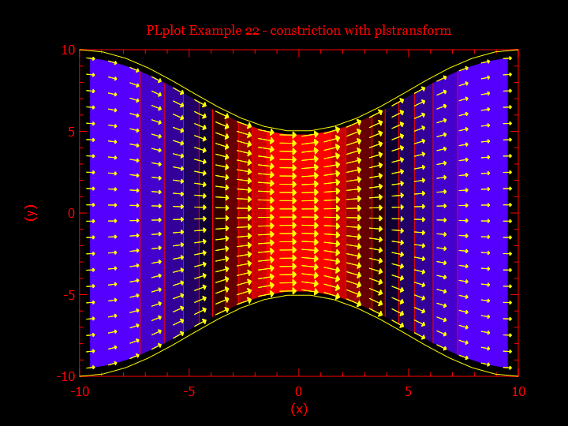

# PLplot for .NET

[](https://ci.appveyor.com/project/surban/plplotnet)

[PLplot](http://plplot.sourceforge.net/) is a cross-platform software package for creating scientific plots whose (UTF-8) plot symbols and text are limited in practice only by what Unicode-aware system fonts are installed on a user's computer.
The open-source PLplot software is primarily licensed under the [LGPL](http://www.gnu.org/licenses/lgpl.html).

The PLplot core library can be used to create standard x-y plots, semi-log plots, log-log plots, contour plots, 3D surface plots, mesh plots, bar charts and pie charts. Multiple graphs (of the same or different sizes) may be placed on a single page, and multiple pages are allowed for those device formats that support them.

The following output file formats are supported: PDF, PNG, JPEG, PostScript.  
Supported operating systems: Linux, MacOS, Windows.

[Click here to see a full gallery of PLplot's abilities.](http://plplot.sourceforge.net/examples.php)



## .NET Standard 2.0 bindings

This project provides a complete, but unofficial, .NET binding for PLplot.
It allows you to use PLplot from C#, F#, Visual Basic or any other .NET language.
We are targeting .NET Standard 2.0 and have tested the bindings on Linux, MacOS and Windows.

The simplest way of installing the package is to run the following command from inside your project directory.

```dotnet add package PLplot```

Alternatively you can download the NuGet package from <https://www.nuget.org/packages/PLplot>.

### Linux

For Linux, PLplot must be pre-installed on your system, i.e. we are expecting to find `libplplot.so.15` in your `LD_LIBRARY_PATH`.
Usually a recent package from your favorite distribution will work fine.
On Ubuntu you can run the following command to install the necessary dependencies.

```sudo apt install libplplot15 plplot-driver-cairo```

### MacOS

On MacOS, PLplot must also be pre-installed on your system.
We are expecting to find `libplplot.dylib` in your `LD_LIBRARY_PATH`.
Using [Homebrew](https://brew.sh/) the necessary dependencies can be installed by running the following command.

```brew install plplot```

### Windows

The native libraries for Windows (x64) are included, so you don't have to worry about them.
The only requirement is that the [Microsoft Visual C++ Redistributable 2017](https://support.microsoft.com/en-us/help/2977003/the-latest-supported-visual-c-downloads) is installed on your system.


## Documentation

Check out [the introductory examples](Examples.md) to get started.

The [official PLplot manual](http://plplot.sourceforge.net/docbook-manual/plplot-html-5.13.0/) explains how to use the library in great detail.
All principles described therein also apply to the .NET library.

We also provide [mostly complete reference documentation](xref:PLplot.PLStream).

## Source code

Source code is available at <https://github.com/surban/PLplotNet>.
Please use GitHub to report trouble with the library and send me your pull request.

## Authors

[Sebastian Urban](http://www.surban.net) (.NET bindings)  
[PLplot developers](http://plplot.sourceforge.net/credits.php)

***
